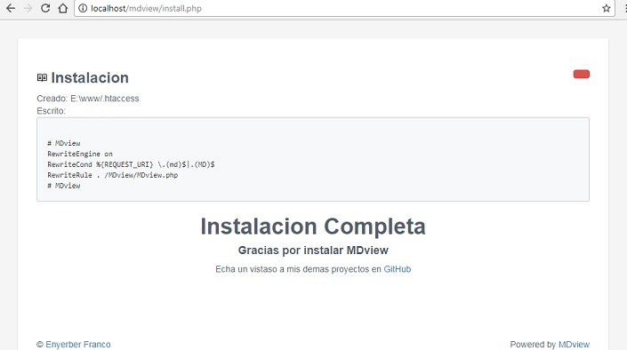
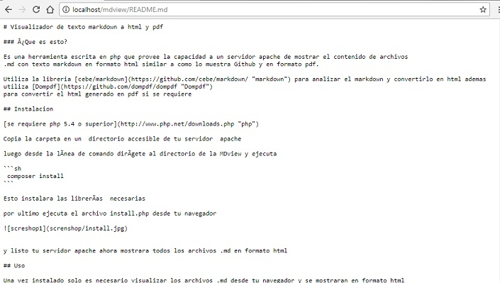
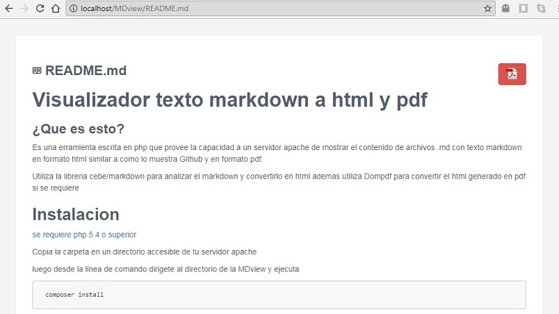
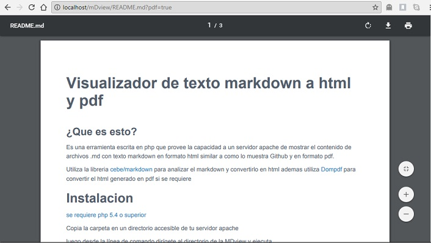

# Visualizador de texto markdown a html y pdf

### ¿Que es esto?

Es una herramienta escrita en php que provee la capacidad a un servidor apache de mostrar el contenido de archivos
.md con texto markdown en formato html similar a como lo muestra Github y en formato pdf.

Utiliza la libreria [cebe/markdown](https://github.com/cebe/markdown/ "markdown") para analizar el markdown y convertirlo en html ademas utiliza [Dompdf](https://github.com/dompdf/dompdf "Dompdf") 
para convertir el html generado en pdf si se requiere 

## Instalacion 

[se requiere php 5.4 o superior](http://www.php.net/downloads.php "php")

Copia la carpeta en un  directorio accesible de tu servidor  apache 

luego desde la línea de comando dirígete al directorio de la MDview y ejecuta

```sh
 composer install 
```

Esto instalara las librerías  necesarias 

por ultimo ejecuta el archivo install.php desde tu navegador 




y listo tu servidor apache ahora mostrara todos los archivos .md en formato html

## Uso 

Una vez instalado solo es necesario visualizar los archivos .md desde tu navegador y se mostraran en formato html

### Ejemplo

Sin instalar MDview al llamar un archivo .md con el navegador se muestra de la siguiente manera



Una vez instalado mostrara los archivos .md en formato html



Para visualizarlo en formato PDF solo se tiene que presionar el botón rojo con el icono

